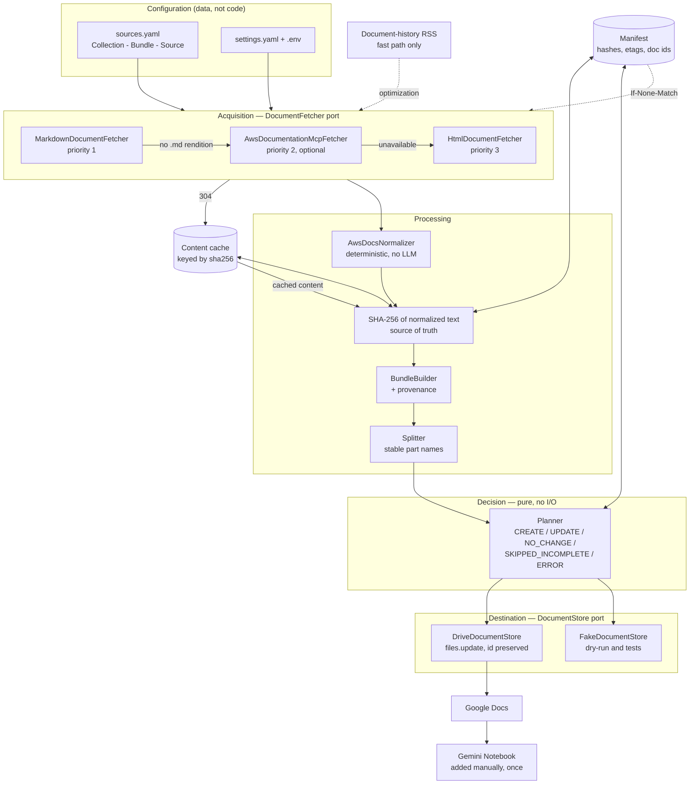

# aws-doc-gemini-sync

Keeps a synchronized, traceable copy of AWS official documentation in Google Docs,
so a Gemini Notebook can use it as a knowledge source without ever fetching or
versioning AWS documentation itself.

## Overview

```
Canonical Source        AWS Official Documentation
        |                 (docs.aws.amazon.com)
        v
Acquisition             this project
        |                 fetch -> normalize -> hash -> bundle
        v
Synchronized Cache      Google Drive / Google Docs
        |
        v
Reasoning               Gemini Notebook
```

Each layer has exactly one job. AWS owns the truth. This pipeline owns
*acquisition and change detection*. Google Drive owns *storage*. Gemini owns
*reasoning* — and is given no responsibility for knowing when AWS changed
something.

What that buys you:

- **No summarization.** AWS text is reproduced verbatim. Quotas, Region
  constraints, IAM policy JSON, and deprecation notices reach the notebook intact,
  because an LLM rewrite is exactly where that detail goes missing.
- **Traceability.** Every section in every document carries its source URL,
  retrieval time, and the SHA-256 of the normalized text. Any claim in a Gemini
  answer can be walked back to the page and revision it came from.
- **Idempotency.** Running the same sync twice writes nothing the second time.
  Google Doc IDs stay stable, so notebook sources never need rewiring.
- **Failure isolation.** One AWS page returning 503 costs that page, not the run —
  and never causes a good document to be overwritten with an incomplete one.
- **Cheap steady state.** Sources whose ETag still matches are revalidated with a
  conditional request and served from a local content-addressed cache, so a
  routine sync of an unchanged corpus transfers no document bodies at all.

## Architecture



### Why it is shaped this way

| Decision | Reason |
|---|---|
| Markdown endpoint first, HTML last | `docs.aws.amazon.com/.../page.md` exists for most pages and is served as `text/markdown`. Using it avoids an HTML→Markdown conversion entirely, which is where code blocks and tables get damaged. The rewrite is **not** universal, so every response is checked on status, Content-Type, and minimum length. |
| Hash **after** normalization | AWS rotates markup, ETags, and whitespace far more often than it rewrites prose. Hashing raw bytes would rebuild Google Docs for changes no reader would notice. |
| RSS is an optimization, never an authority | Several guides (IAM, for one) publish no feed at all, and a feed can only observe its own guide. `scan` re-hashes everything and is the safety net. |
| Conditional requests are an optimization too | `scan` and `sync --full` never send validators. If AWS ever served a wrong ETag, a conditional request would hide that change forever; a full pass always re-reads the bytes. |
| The content cache is **content-addressed** | The key is the SHA-256 of what it stores, so an entry cannot go stale, corruption is detectable on read, and a miss degrades to an ordinary fetch. There is no invalidation logic to get wrong. |
| Validators are bound to the URL that issued them | The same page is reachable at `page.md` and `page.html`; those are different resources with different ETags. Sending one resource's validator while requesting another is simply a bug waiting to happen. |
| Validators are only sent when the cache can answer | A 304 whose content cannot be recovered costs a round trip and saves nothing — it would be slower than not asking. |
| Provenance timestamps come from the manifest | They advance only when the content hash moves. Rendering `datetime.now()` would make every run produce a different document and destroy idempotency. |
| `files.update`, never delete-and-recreate | The Drive file ID is what a Gemini Notebook holds. Recreating the file silently detaches every notebook that referenced it. |
| One Google Doc per **bundle** | One doc per AWS page would exhaust a notebook's source budget inside a single service. |
| A split that renames a document **carries its id over** | `AWS_X` becoming `AWS_X_01` is a rename, performed in place by `files.update`. Creating new documents instead would detach every notebook pointing at the original. |
| The manifest is **locked for the whole load-modify-save cycle** | Two concurrent runs would otherwise both read it and both write it, and the loser's document ids would vanish — so the next run would create duplicates of every document it could no longer find. |
| The MCP backend paginates by the server's **own markers**, never by length | A truncated response is *longer* than the content it carries, because the truncation marker is part of it. Advancing by the response length skips real text while splicing protocol markers into the page — corruption that preserves the total length, and so hides from any check that counts characters. |
| The planner performs no I/O | Every idempotency and safety rule is unit-tested directly instead of through a mocked Google client. |
| No `delete` method exists on the store | Removing a knowledge source is a human decision. Disappeared pages are recorded as orphans and reported. |

### Repository layout

```
src/aws_doc_sync/
├── cli.py                     Typer commands, exit codes
├── runtime.py                 composition root: the only place adapters are chosen
├── logging_setup.py           structured stdout logging, secret redaction
├── domain/
│   ├── models.py              DocumentSource, RawDocument, NormalizedDocument,
│   │                          Bundle, BundleDocument, StoredDocument
│   ├── protocols.py           DocumentFetcher, DocumentStore, CredentialProvider, ...
│   ├── urls.py                canonical URL identity, .html <-> .md
│   └── errors.py              isolated (SourceError) vs fatal (ConfigError)
├── config/
│   ├── settings.py            YAML behaviour + env-only credentials
│   └── registry.py            sources.yaml -> domain objects, invariant checks
├── fetchers/
│   ├── http_client.py         retry + conditional requests (If-None-Match)
│   ├── markdown.py            priority 1
│   ├── aws_mcp.py             priority 2 (optional extra)
│   ├── html.py                priority 3
│   └── chain.py               fall-through rules
├── normalize/
│   ├── aws_docs.py            deterministic cleanup, link absolutization
│   ├── html_to_markdown.py    AWS-specific HTML conversion
│   └── common.py              fence-aware primitives, hashing
├── change_detection/
│   ├── hash.py                source of truth
│   └── rss.py                 fast path
├── bundling/
│   ├── builder.py             provenance rendering, composition hash
│   └── splitter.py            stable part packing
├── google/
│   ├── auth.py                OAuth / service account behind one port
│   ├── drive.py               create + update, importFormats probe
│   ├── docs.py                read-back verification
│   └── fake.py                in-memory store, read-only guard
├── manifest/
│   ├── models.py              SourceState, BundleState, SyncManifest
│   ├── content_cache.py       content-addressed store; makes 304 actionable
│   └── repository.py          atomic JSON persistence
└── sync/
    ├── planner.py             pure decisions
    ├── service.py             orchestration, failure isolation
    └── results.py             report and exit codes
```

This follows the structure in the specification, with three additions worth
naming: `runtime.py` exists so that wiring is not duplicated between the CLI and
tests; `sync/planner.py` is split out from the service so decisions can be tested
without any I/O at all; and `google/fake.py` gives dry runs and unit tests the
same code path as a real sync, so a dry run is a genuine rehearsal rather than a
parallel implementation that can drift.

## Requirements

- Python 3.12 or newer
- [uv](https://docs.astral.sh/uv/) (or any standard `pyproject.toml` workflow)
- A Google account with Drive access
- A Google Cloud project with the Drive and Docs APIs enabled

## Installation

```bash
uv sync
```

Or without uv:

```bash
python -m venv .venv && source .venv/bin/activate
pip install -e ".[dev]"
```

Optional — enables the AWS Documentation MCP Server backend:

```bash
uv sync --extra mcp
```

Then set `mcp.enabled: true` in `settings.yaml`. It sits between the Markdown and
HTML backends, so it is only consulted for pages with no `.md` rendition. Its
`read_documentation` tool defaults to returning **5000 characters** and signals
both continuation and exhaustion in-band; this adapter always sends an explicit
`max_length` and follows the server's own continuation offsets, which is what
makes the assembled content independent of that setting.

## Google Cloud setup

Console paths below were checked against Google's current documentation. Google
moved OAuth configuration out of *APIs & Services* and into **Google Auth
Platform**; older tutorials still describe the previous location.

1. Open the [Google Cloud console](https://console.cloud.google.com/) and create
   a project (or select an existing one).
2. **APIs & Services → Library → Google Workspace**: enable **Google Drive API**
   and **Google Docs API**. Equivalent CLI:
   `gcloud services enable drive.googleapis.com docs.googleapis.com`
3. **Google Auth Platform → Branding**. On a new project this shows *Google Auth
   platform not configured yet* → **Get Started**, then: app name and support
   email → **Audience** (*Internal* on Workspace, otherwise *External*) →
   contact email → accept the User Data Policy → **Create**.
4. If you chose *External*: **Google Auth Platform → Audience → Test users →
   Add users**, and add **the exact address you will sign in with**. Skipping
   this produces `Error 403: access_denied` at consent time, and picking a
   different account in the browser's account chooser produces the same error.
5. **Google Auth Platform → Clients → Create Client → Application type: Desktop
   app** → name it → **Create**. Download the JSON from the client's row; that
   file is `GOOGLE_CLIENT_SECRETS_FILE`.
6. Create a Drive folder for the generated documents. Its ID is the last path
   segment of the folder URL:
   `https://drive.google.com/drive/folders/`**`1AbCdEfGhIjKlMnOpQrStUv`**

### Scopes

The application requests the **narrowest scopes that do the job**:

| Scope | Why |
|---|---|
| `drive.file` | Create and manage **only files this app created**. A bug here cannot touch the rest of your Drive. |
| `documents.readonly` | Read a document back after writing, to confirm the Markdown conversion produced a non-empty body. |

Two consequences of `drive.file` are worth knowing:

- Documents created by a *different* OAuth client are invisible to this one. If
  you rotate OAuth clients, the next sync creates fresh documents rather than
  adopting the old ones.
- Whether a file can be created inside a folder the **user** made in the Drive UI
  (rather than one this app created) is not something Google's documentation
  states either way, and it has not been tested here. If a first sync fails with
  a 404 on the parent folder, the fix is one of: let the app create its own
  folder and use that ID, or widen the scope to
  `https://www.googleapis.com/auth/drive` in `google/auth.py` and re-authorize.

## OAuth setup

```bash
cp .env.example .env
```

Only two values have to be filled in (never commit `.env`):

```bash
GOOGLE_CLIENT_SECRETS_FILE=/absolute/path/to/client_secret_xxx.json
GOOGLE_DRIVE_FOLDER_ID=1AbCdEfGhIjKlMnOpQrStUv
```

Alternatively supply `GOOGLE_CLIENT_ID` and `GOOGLE_CLIENT_SECRET` directly
instead of the secrets file.

**`GOOGLE_TOKEN_PATH` is not something you obtain.** It names the file this tool
*writes* — the first real sync opens a browser for consent and caches the
resulting refresh token there with owner-only (`0600`) permissions, creating the
directory if needed. Every later run reuses it and never opens a browser. Leave
the variable unset to accept the default `.state/token.json`; delete the file to
force re-authorization.

### The 7-day refresh token, and how to avoid it

Google issues a refresh token that **expires after 7 days** to any project whose
consent screen is *External* **and** whose publishing status is *Testing*. That
is fine for trying this out, and unworkable for a daily scheduled sync: the token
dies every week and the next run needs a human at a browser.

Pick one before automating:

| Option | Re-consent | Notes |
|---|---|---|
| External + Testing | **every 7 days** | Fine for evaluation. Not for cron. |
| **Internal** | never | Requires a Google Workspace account. Set it under *Google Auth Platform → Audience*. No test users needed. |
| External + **In production** | never | *Audience → Publish app*. Unverified apps still work for personal use — you keep clicking through the "Google hasn't verified this app" screen — and are capped at 100 users. |
| **Service account** | never | No user consent at all. Set `GOOGLE_AUTH_METHOD=service_account`, and share the destination Drive folder with the service account's address. The best fit for unattended execution. |

Confirm the setup before running a sync:

```bash
uv run aws-doc-sync validate-config
```

It prints a redacted summary (`client_secret_set: True`, never the value) and
ends with `configuration OK` when Google is ready.

### Service accounts (unattended execution)

```bash
GOOGLE_AUTH_METHOD=service_account
GOOGLE_SERVICE_ACCOUNT_FILE=/absolute/path/to/service-account.json
GOOGLE_IMPERSONATE_SUBJECT=you@example.com   # Workspace domain-wide delegation only
```

A service account has its own Drive, so either share the destination folder with
the service account's email address, or use domain-wide delegation to impersonate
a real user. Both credential paths sit behind the same `CredentialProvider` port,
so nothing else in the codebase changes.

## AWS source configuration

```bash
cp config/sources.example.yaml  config/sources.yaml
cp config/settings.example.yaml config/settings.yaml
```

`sources.yaml` has three levels:

```yaml
collections:
  aws_ai_ml:                         # selected with --collection
    bundles:
      sagemaker_training:            # selected with --bundle; becomes ONE Google Doc
        output: AWS_SageMaker_Training
        title: Amazon SageMaker AI - Training
        rss_feeds:
          - https://docs.aws.amazon.com/sagemaker/latest/dg/amazon-sagemaker-release-notes.rss
        sources:
          - url: https://docs.aws.amazon.com/sagemaker/latest/dg/how-it-works-training.html
          - url: https://docs.aws.amazon.com/sagemaker/latest/dg/train-model.html
```

Group pages the way a *question* would span them, not the way AWS's navigation
tree happens to be shaped. A bundle is the unit a notebook consumes.

Rules the loader enforces, because violating them makes results ambiguous:

- Bundle IDs are globally unique.
- Two bundles may not share an `output` name — they would fight over one Drive file.
- The same source URL may not appear in two bundles — it would duplicate content
  across knowledge sources and inflate the notebook's token budget.

The shipped example registry contains **49 real, verified URLs** across SageMaker
Training/Inference, Bedrock, IAM, ECR, and CloudWatch. Two of them
(`bedrock/.../api-setup.html`, `AmazonCloudWatch/.../AlarmThatSendsEmail.html`)
have no `.md` rendition and are included deliberately, so a normal run exercises
the HTML fallback.

Validate before doing anything else:

```bash
uv run aws-doc-sync validate-config
```

## Dry run

Never modifies Google Drive or the manifest. This is the command to reach for
first, and the one to run in CI.

```bash
uv run aws-doc-sync dry-run --collection aws_ai_ml
```

```
=== dry-run (no writes) ===

sagemaker_training  ->  AWS_SageMaker_Training
  CREATE              AWS_SageMaker_Training  61,094 chars
      reason: no existing document found

sources:   NEW=7
documents: CREATE=1
```

It works **without Google credentials**: when none are configured it plans from
the manifest alone and says so. When credentials *are* available it reads live
Drive state (never writing) so the plan reflects reality.

`dry-run` re-reads every page in full by default, so the plan is based on what
AWS is serving right now rather than on cached validators. Pass `--fast` to see
what a routine `sync` would do instead, revalidation and all.

To inspect the exact Markdown that would be uploaded, before any credential is
involved:

```bash
uv run aws-doc-sync fetch --collection aws_ai_ml --out ./out
```

## Initial sync

```bash
uv run aws-doc-sync sync --collection aws_ai_ml
uv run aws-doc-sync sync --all
```

Then confirm the second run is a genuine no-op:

```bash
uv run aws-doc-sync sync --collection aws_ai_ml
# documents: NO_CHANGE=3
```

## Incremental sync

```bash
uv run aws-doc-sync sync --all          # RSS fast path where feeds cover the bundle
uv run aws-doc-sync scan --all          # re-hash everything; no Drive writes
uv run aws-doc-sync sync --all --full   # ignore RSS and rebuild what actually changed
uv run aws-doc-sync status              # what is tracked, where it lives, what is orphaned
```

There are two independent optimizations, and one rule governs both: **they decide
what to check; the hash decides what changed.**

**RSS — skip a whole bundle.** A bundle is skipped only when *every* one of these
holds:

1. RSS is enabled and the bundle's feeds cover **every** source in it;
2. every source already has a stored hash;
3. every document already exists with a recorded composition hash;
4. no feed entry in the lookback window mentions any of those sources.

**Conditional requests — skip a body transfer.** For each source that is checked,
the request carries `If-None-Match` / `If-Modified-Since` when *both* of these
hold:

1. the manifest has an ETag (or `Last-Modified`) recorded against the exact URL
   that produced the current content;
2. the content behind that hash is still in the local cache.

A 304 then means "reuse what you have": the normalized text is read back from
`.state/content-cache/<sha256>` and re-hashing is skipped entirely. A cache miss
is not a failure — the source is simply fetched normally.

So a routine daily sync over an unchanged corpus sends one small conditional
request per source and downloads nothing:

```
sources:   UNCHANGED=49   (revalidated via 304: 49)
documents: NO_CHANGE=7
```

`scan` and `sync --full` bypass **both** optimizations — no RSS hints, no
validators, every page re-read and re-hashed. That is what makes it safe to trust
either one day to day.

### The content cache

`.state/content-cache/` holds one file per normalized document, named after its
own SHA-256. That choice does most of the work:

- it cannot go stale — different content means a different key;
- damage is detectable, because the content is re-hashed on read; a mismatch is
  treated as a miss and the entry is dropped;
- nothing depends on it — every miss falls back to a normal fetch.

It is pruned at the end of each run to the set of hashes the manifest still
references, so superseded revisions do not accumulate. Disable it with
`manifest.content_cache_enabled: false`; conditional requests then stop too,
since a 304 would no longer be actionable.

## Registering the documents with Gemini Notebook

This is a manual, one-time step, and deliberately so. There is no public Gemini
Notebook API for source registration; automating it would mean an undocumented
endpoint or browser automation, both of which break without warning and neither
of which belongs in a pipeline whose job is reliability.

1. Run a sync and note the document links (`aws-doc-sync status` prints them).
2. Open [Gemini](https://gemini.google.com/) and create a Notebook.
3. **Add source → Google Drive**.
4. Select the generated documents (`AWS_SageMaker_Training`, `AWS_Bedrock_Core`, …).

After that, updates flow on their own. Google documents that Drive-imported
sources "are auto-updated and will sync every few minutes", and that changes to
the original document appear when you open the notebook; a source can also be
refreshed by hand with **Click to sync with Google Drive**. This pipeline's
`files.update` keeps each document's ID, so the notebook keeps pointing at the
same file as its content changes.

Limits worth knowing, from the same documentation:

| Limit | Value |
|---|---|
| Sources per notebook | 50 on the free tier (higher on paid plans) |
| Size per source | 500,000 words, or 200MB for uploaded files |
| Not imported | Footnotes and comments from Google files |

The 50-source ceiling is the reason this pipeline bundles. The example registry's
49 pages occupy 7 sources rather than 49, leaving most of the budget free.
`google_docs.hard_max_chars` (500,000 *characters*) is far below the per-source
word limit, so splitting is governed by readability, not by the platform.

You need to revisit the notebook only when a **new** document appears — a new
bundle, or an existing bundle crossing the split threshold. `status` lists the
current document set and any `retired:` documents left behind by a split boundary
that moved; the sync log emits `google_doc_retired` once when that happens.

If a document is deleted in Drive, or you lose access to it, the notebook's
source becomes inaccessible and still counts against the source limit until it is
removed there.

## Scheduled execution

The pipeline holds no scheduler assumptions. Recommended cadence — put it in your
scheduler, not in the code:

| Job | Cadence | Why |
|---|---|---|
| `sync --all` | daily | RSS fast path; cheap |
| `scan --all` | weekly | safety net for guides with no feed, or feeds that miss a change |
| `sync --all --full` | weekly, after `scan` | rebuild whatever the scan found |

### cron

```cron
# Daily incremental sync at 03:00
0 3 * * *   cd /path/to/aws-doc-gemini-sync && /usr/local/bin/uv run aws-doc-sync sync --all >> /var/log/aws-doc-sync.log 2>&1
# Weekly full re-hash and rebuild, Sundays at 04:00
0 4 * * 0   cd /path/to/aws-doc-gemini-sync && /usr/local/bin/uv run aws-doc-sync sync --all --full >> /var/log/aws-doc-sync.log 2>&1
```

Local cron is the easiest option for OAuth, because the cached refresh token lives
on the same machine where you granted consent — **provided the consent screen is
not left as External + Testing**, whose refresh tokens expire after 7 days. See
[The 7-day refresh token](#the-7-day-refresh-token-and-how-to-avoid-it).

### GitHub Actions

```yaml
name: aws-doc-sync
on:
  schedule:
    - cron: "0 3 * * *"
  workflow_dispatch:

jobs:
  sync:
    runs-on: ubuntu-latest
    steps:
      - uses: actions/checkout@v4
      - uses: astral-sh/setup-uv@v5
      - run: uv sync

      # .state holds the manifest and the content cache -- local state, not
      # repository content. Caching it lets the run tell NO_CHANGE from CREATE
      # and revalidate with 304s instead of re-downloading every page. A cold
      # .state still works: documents are adopted by name, not duplicated.
      - uses: actions/cache@v4
        with:
          path: .state
          key: aws-doc-sync-manifest-${{ github.run_id }}
          restore-keys: aws-doc-sync-manifest-

      - run: uv run aws-doc-sync sync --all
        env:
          GOOGLE_AUTH_METHOD: service_account
          GOOGLE_SERVICE_ACCOUNT_FILE: ${{ runner.temp }}/sa.json
          GOOGLE_DRIVE_FOLDER_ID: ${{ secrets.GOOGLE_DRIVE_FOLDER_ID }}
```

Write the service-account JSON from a secret to `${{ runner.temp }}/sa.json` in a
preceding step. Use a **service account** here, not OAuth: an interactive consent
flow cannot complete on a runner.

### AWS EventBridge + ECS/Lambda

Workable, with two caveats: put the credential in Secrets Manager rather than an
environment variable, and give the manifest somewhere durable (EFS, or an S3
object synced around the run). Without a persistent manifest every run re-uploads
every bundle — correct, but wasteful and noisy.

## Troubleshooting

**`GOOGLE_DRIVE_FOLDER_ID is not set`** — `validate-config` reports it and
`dry-run` still works. Copy the ID out of the folder URL into `.env`.

**`Error 403: access_denied` at the consent screen** — the account you signed in
with is not on the test-user list. Add it under **Google Auth Platform → Audience
→ Test users → Add users**, then retry. If you have several Google accounts,
check that the one you picked in the account chooser is the one you added.

**Consent worked, then stopped working about a week later** — the consent screen
is *External* + *Testing*, whose refresh tokens expire after 7 days. See
[The 7-day refresh token](#the-7-day-refresh-token-and-how-to-avoid-it).

**Browser does not open, or consent fails on a headless machine** — authorize once
on a desktop, then copy the generated token file to `GOOGLE_TOKEN_PATH` on the
server, or switch to a service account.

**`cached token ... is unreadable`** — delete the token file and re-authorize.

**Everything is `CREATE` on a machine that has synced before** — the manifest is
missing. The documents are still adopted by name (no duplicates), and the run
rewrites them once. To avoid it, persist `.state/`.

**A document stayed at `SKIPPED_INCOMPLETE`** — a source in that bundle failed to
fetch, and the existing document was protected rather than overwritten with
partial content. The report names the failing URL. Re-run once AWS recovers, or
pass `--allow-partial` if you accept the gap.

**A source is reported `ORPHANED`** — AWS returned 404/410, or you removed the URL
from the registry. Nothing is deleted; it is recorded so you can decide. Remove
the URL from `sources.yaml` to stop checking it.

**`google_doc_body_empty`** — Drive accepted the upload but the conversion
produced nothing. Check `import_mime_type` in `settings.yaml`; pin it to
`text/plain` to confirm the upload path itself works.

**A page is fetched via `html` when you expected `markdown`** — that page has no
`.md` rendition, or the one it has is a table-of-contents stub below
`fetch.min_markdown_chars`. Both are normal. The log line `source_fetch_fallback`
names the reason.

**Rate limiting** — lower `http.requests_per_second`. 429 and 5xx are retried with
exponential backoff and full jitter; other 4xx are never retried.

**No sources are being revalidated (`revalidated via 304: 0`)** — expected on a
first run, after `scan`/`--full` (which deliberately skip validators), and after
the cache has been cleared. If it persists on ordinary `sync` runs, check that
`.state/content-cache/` is writable and that `manifest.content_cache_enabled` is
true.

**Disk usage from `.state/content-cache/`** — it holds one copy of every
normalized source, roughly the size of the corpus (~600 KB for the 49-page
example registry). Pruning keeps only live revisions. Delete the directory at any
time; the next sync refills it.

## Security notes

- **Nothing credential-bearing is ever read from YAML.** Credentials come only
  from the environment or `.env`. `settings.yaml` is safe to commit and review.
- **Keep credential files outside the repository** — `~/.config/aws-doc-sync/` is
  a reasonable home. `.gitignore` covers the names these files usually arrive
  with (`*client_secret*.json`, `*.apps.googleusercontent.com.json`,
  `*credential*.json`, `*token*.json`, `service-account*.json`, `*.pem`, `*.key`,
  `.env`, `.state/`), but a browser-assigned name such as `downloaded (1).json`
  matches no rule anyone could write in advance. Pattern matching is the safety
  net; location is the control. `validate-config` prints a warning when it finds
  a credential inside the project directory.
- `.env.example` contains **variable names only**.
- The cached OAuth token is written with `0600`.
- Log records are redacted: any field whose name contains `token`, `secret`,
  `password`, `credential`, `client_id`, or `refresh` is replaced with `***`.
  Document bodies are never logged — only URLs, hashes, and character counts.
- `validate-config` reports whether each credential is *set*, never its value.
- Scopes are minimized to `drive.file` and `documents.readonly`.
- The manifest is local state and must not be committed: two people syncing the
  same registry to different Drive folders would otherwise overwrite each other's
  document IDs. `.state/` covers the content cache as well — it holds only public
  AWS documentation, but it is still machine-local state, not repository content.

## Development

```bash
uv run pytest                  # unit suite; no network, no Google
uv run ruff check src tests
uv run mypy
```

Integration tests are deselected by default.

```bash
# Read-only checks against live docs.aws.amazon.com
uv run pytest -m integration tests/integration/test_live_aws.py

# Creates real Drive files. Point it at a throwaway folder, never your notebook's.
export AWS_DOC_SYNC_IT_FOLDER_ID=<throwaway folder id>
uv run pytest -m integration tests/integration/test_google_drive.py
```

### Exit codes

| Code | Meaning |
|---|---|
| `0` | Everything succeeded |
| `1` | Partial failure — some sources or documents failed, others succeeded |
| `2` | Nothing usable was produced (bad config, missing credentials) |

A scheduler should treat `1` as "look at this", not as "the run was a disaster":
the sources that did sync are live and correct.

## Privacy

[PRIVACY.md](PRIVACY.md) describes what the tool accesses and where it stores
things. It doubles as the privacy policy URL that Google's OAuth consent screen
asks for. In short: everything runs and is stored on your own machine, and the
only outbound destinations are AWS's public documentation site and Google's own
APIs acting as you.

## License

MIT
